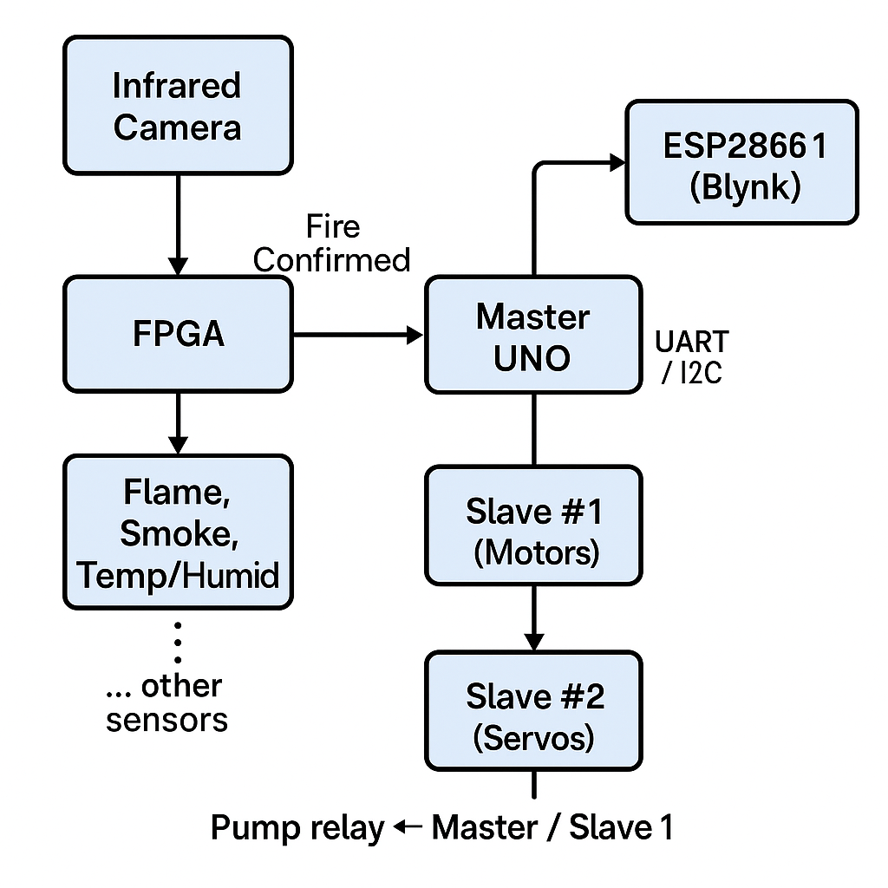

# 🔥 Autonomous Firefighting Robot | Final Year Project  

**Certified by the International Journal of Multidisciplinary Research**  
**Developed using Arduino, FPGA, IoT, and Deep Learning**

---

## 🚀 Project Overview  
A 25–28 kg tracked robot that autonomously detects, verifies, and extinguishes indoor fires. It fuses data from flame, smoke, temperature/humidity, PIR, ultrasonic and UWB radar sensors with infrared-camera frames. A custom CNN deployed on an FPGA confirms real fires (rejecting false positives like hot objects or sunlight). A second CNN for live-human detection was designed as a v2 concept but not yet implemented. Prototype-1 achieved over 95% accuracy in lab fire-detection tests.

---

## 🧠 System Architecture

> **Figure 1:** High-level block diagram of the firefighting robot.  
> - **Master Arduino UNO** aggregates data from all fire‐detection sensors and issues commands.  
> - **Slave UNO #1** drives the track motors via Cytron MDD3A drivers.  
> - **Slave UNO #2** controls the 2-axis water-nozzle and 3-axis camera servos via a PCA9685 board.  
> - **FPGA** performs CNN-based fire confirmation using infrared camera frames.  
> - **ESP8266 #1** handles remote control & telemetry through the Blynk cloud; **ESP8266 #2** serves as a backup channel.  
> - A 2 HP centrifugal pump is switched on by a relay under Master/Slave control.

## 🛠️ Key Components & Innovations  

- **AI-Based Fire Confirmation**  
  - CNN trained on infrared-camera images + multi-sensor data  
  - FPGA-accelerated inference for real-time decision-making  
- **Human-Detection Concept (v2)**  
  - Designed a separate CNN + computer-vision pipeline to detect humans and assess life signs (concept stage only)  
- **Master-Slave Microcontroller Network**  
  - 1 × Master Arduino UNO (sensor fusion & logic)  
  - 2 × Slave Arduino UNO (motor/I²C I/O expander & servo control)  
  - 1 × Arduino Mega (testing routines only)  
- **IoT & Telemetry**  
  - 2 × ESP8266 modules running Blynk for remote monitoring, control & live video  
- **Mechanical & Fluid Systems**  
  - 6-wheel caterpillar tracks with front shock absorbers (stair-climbing)  
  - Orange OG555 DC motors (12 V, 680 N-cm) + 3 × Cytron MDD3A drivers  
  - 2 HP centrifugal water pump + high-pressure nozzle (2-axis servo)  

---

## 🎬 Demo Video  
  
*Unlisted demo of prototype-1 in action*

---

## 🏅 Certifications & Awards  
- 📰 **Journal Publication**: *International Journal of Multidisciplinary Research*  
  - [Abstract PDF](Certificates/Journal_Abstract.pdf)  
- 🏆 **Award**: Winner at University Innovation Showcase  

---

## 🧠 Key Skills Demonstrated  
- Embedded Systems (Arduino, ESP8266, FPGA)  
- Real-Time Sensor Fusion & Control  
- **Deep Learning & Computer Vision** (CNN for fire confirmation; human-detection concept)  
- IoT Integration (Blynk App)  
- Autonomous Navigation & Fire Suppression  

---

## 🗂️ Repository Structure  

firefighting-robot-public/
├── media/
│ ├── architecture.png # Block diagram
│ ├── robot_front.jpg # Prototype photo
│ └── demo-video.mp4 # Unlisted YouTube demo
│
├── Certificates/
│ ├── Journal_Abstract.pdf # Redacted paper abstract / certificate
│ └── Awards.pdf # Showcase/competition certificate
│
├── Overview/
│ ├── Project_Summary.md # Problem statement, objectives, impact
│ └── Key_Features.md # High-level bullet points
│
└── README.md # Main project overview (this file)

> ⚠️ **Note**: Source code, detailed schematics and raw data are kept private to protect intellectual property. Recruiters may request access on demand.  
